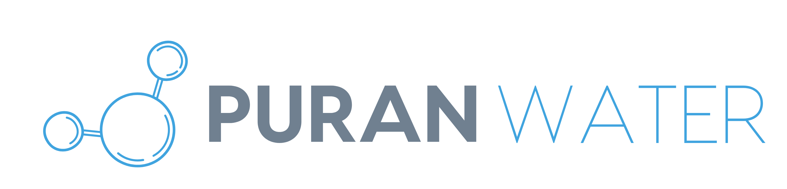

Wastewater process engineering tools designed for programmatic access by AI agents.

## Approach

These tools implement the Model Context Protocol (MCP), providing structured JSON interfaces for deterministic engineering calculations. AI agents can compose multi-step workflows by calling tools programmatically rather than requiring human operators to navigate graphical interfaces.

Engineering drawings follow a database-first architecture where machine-readable data models (DEXPI for P&IDs, SFILES for BFDs/PFDs) generate visualizations. This inverts the traditional CAD workflow, enabling version control via git and automated diff operations on the underlying data structures.

## Repositories

### Process Design
- **ro-design-mcp** - Reverse osmosis system optimization using WaterTAP framework with 67 manufacturer membrane models
- **ix-design-mcp** - Ion exchange (SAC/WAC) vessel sizing with USEPA Gaines-Thomas equilibrium solver
- **degasser-design-mcp** - Packed tower air stripper design using Perry's Handbook correlations and pH-dependent speciation
- **evaporator-design-mcp** - Industrial evaporator design (MVR/MVC/MEE) with three-tier architecture: heuristic sizing using correlations, WaterTAP/watertap-reflo simulation for rigorous mass & energy balance, and economic costing with CAPEX/OPEX analysis. Supports falling film and forced circulation configurations with PHREEQC speciation for high-TDS brines (25-35 wt%)
- **anaerobic-design-mcp** - Anaerobic digester design using mADM1 (Modified ADM1) with 63-component model including P/S/Fe extensions for nutrient recovery via QSDsan
- **aerobic-design-mcp** - Activated sludge design with mASM2d (Modified ASM2d) incorporating Monod kinetics, MLSS-dependent alpha factors, and mass-balance-based flowsheet selection
- **primary-clarifier-mcp** - Primary clarifier design

### Engineering Calculations
- **fluids-mcp** - Pipe flow, control valve sizing (IEC 60534), and pump/compressor design
- **heat-transfer-mcp** - Tank heat loss, heat exchanger sizing, insulation design with 390+ material database
- **water-chemistry-mcp** - PHREEQC-based aqueous geochemistry for speciation, scaling, and chemical dosing
- **corrosion-engineering-mcp** - Physics-based corrosion rate prediction with CO₂/H₂S corrosion models, galvanic series database, and PHREEQC integration for aqueous speciation

### CAE Integration
- **autocad-mcp** - AutoLISP code generation for AutoCAD LT with ISA 5.1 P&ID symbol library
- **mathcad-mcp** - PTC MathCAD Prime COM automation for worksheet control
- **tia-portal-mcp** - Siemens TIA Portal read-only interface for SCADA integration

### Process Documentation
- **dexpi-sfiles-mcp-server** - ISO 15926-compliant P&ID data models (DEXPI) and compact flowsheet notation (SFILES)

### Compliance & Regulatory
- **compliance-agent** - Automated monitoring of regulations (Federal Register, eCFR, CARB) and permit management (NPDES, Title V, RFS/LCFS)

### Business Tools
- **lead-generation** - MCP servers for business development workflows

## Technical Patterns

- **Aqueous chemistry**: PHREEQC via PhreeqPython for thermodynamically rigorous water chemistry
- **Process costing**: WaterTAP integration for CAPEX/OPEX analysis and levelized cost calculations
- **Thermodynamic properties**: CoolProp, Thermo, and Fluids libraries with NIST-validated correlations
- **Framework**: FastMCP for rapid MCP server development
- **Validation**: Physics-based calculations with literature-sourced parameters rather than empirical approximations

## Reporting

Engineering MCP servers generate **Markdown reports** with:
- **Obsidian frontmatter** for metadata and searchability via Obsidian MCP server
- **Mermaid diagrams** for process flowsheets
- **LaTeX equations** for engineering calculations with symbolic notation

Rationale:
1. **LLM-native format** - Markdown is the native "word processor" for AI agents, enabling seamless reading/writing without parsing overhead
2. **Git version control** - Plain text reports are diffable, enabling standard version control workflows for design artifacts (track changes, rollbacks, blame)
3. **Cross-platform readability** - Reports render in GitHub, VS Code, Obsidian, and any text editor without proprietary software
4. **Programmatic organization** - Global Obsidian MCP server provides semantic search and organization across all design artifacts via frontmatter metadata
5. **Client deliverable conversion** - When client-facing deliverables require traditional formats, Pandoc converts Markdown reports to branded PDF, Word, or PowerPoint documents using custom templates. This preserves Markdown as the version-controlled source of truth while enabling professional formatting for external stakeholders.

This replaces traditional .docx/.xlsx reporting, which requires binary diff tools and lacks the compositional properties needed for AI-driven workflows.

### Client Deliverable Conversion

When client-facing deliverables require traditional formats, Pandoc converts Markdown reports to branded PDF, Word, or
PowerPoint documents using custom templates. This preserves Markdown as the version-controlled source of truth while
enabling professional formatting for external stakeholders.

\`\`\`bash
# Example: Branded PDF with company template
pandoc report.md -o report.pdf --template=company-template.tex --pdf-engine=xelatex
\`\`\`

## Rationale

Domain experts should spend their time exploring the full design space, solving complex problems, and anticipating edge cases that lead to failures. By orchestrating AI agents through structured APIs, engineers delegate routine calculations and document generation, freeing cognitive resources for higher-value activities.

AI agents handle:
1. Parametric design iterations across multiple operating conditions
2. Generation of calculation reports and technical drawings
3. Compliance documentation and regulatory submissions
4. Integration of results across multiple analysis domains
5. Version control and change tracking for engineering artifacts

Git-compatible data formats (JSON, structured text) enable standard version control workflows for engineering artifacts traditionally locked in proprietary binary formats.
