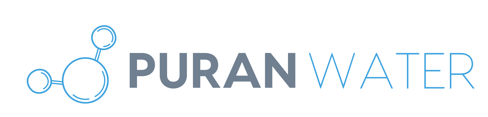

AI-native wastewater process engineering. Wastewater process engineering tools with schema'd state and deterministic simulation engines, designed for programmatic access by AI agents.

## The Operating Model

Puran Water builds the digital infrastructure for an industrial wastewater design-build-operate firm. The architecture rests on a central thesis: an AI-native industrial firm needs a properly schema'd data substrate first — not a memory system or RAG pipeline as the primary knowledge store.

That substrate comes from three sources: self-hosted enterprise OSS (each brings a Postgres-backed domain ontology), purpose-built engineering schemas (plant-state model, process unit types, ISA 5.1 instrumentation, DEXPI equipment classes, model credibility metadata), and custom domain schemas (procurement, process datasheets, bid specifications, compliance). All exposed via typed MCP tool surfaces.

```
External systems and human operators
            |
Communication / orchestration runtime
            |
Persona layer (role-scoped agents) + reusable skills
            |
MCP server layer (server codebases)       <-- this org
            |
Business systems + engineering engines
```

The MCP servers in this org are the **tool layer** — the typed interfaces between AI agents and deterministic engineering computation. They sit within a larger operating system that includes project management, CRM, procurement, compliance, and autonomous orchestration, documented in **[PuranOS-public](https://github.com/puran-water/PuranOS-public)**.

## Why Engineering Needs Its Own Tool Surface

The MCP ecosystem has grown to 10,000+ servers (as of early 2026). Many are developer and infrastructure oriented: databases, browsers, file systems, cloud APIs. While engineering-adjacent MCP servers exist for CAD tools, building energy simulation, and power grid modeling, the wastewater and chemical process engineering domain remains sparse.

This gap matters. Industrial process engineering has properties that generic AI tooling cannot address:

- **Calculations must be deterministic and auditable.** A pump sizing is not a language task. It is an engineering problem with a verifiable answer. LLM-generated numbers are not acceptable for engineering design — the calculation must be reproducible and traceable to published correlations or validated simulation models.

- **Models chain across engines.** A treatment train flows from biological treatment (QSDsan, mASM2d plant state) through reverse osmosis (WaterTAP, MCAS plant state). Sizing, simulating, and costing a flowsheet requires typed converters with provenance tracking at every handoff.

- **Results carry credibility.** A preliminary heuristic sizing, an uncalibrated simulation, and a calibrated dynamic simulation all produce a plant state. They have fundamentally different reliability. Every simulation result must carry explicit metadata: model status (calibrated/preliminary), decision grade (design/budgetary), and validation basis (bench-test/plant-data/literature/vendor/assumed).

- **Formats must be machine-readable and standards-aligned.** P&IDs as DEXPI XML, using DEXPI's vendor-neutral model and ISO 15926-aligned reference concepts. Process flows as SFILES text. Equipment tagged per ISA 5.1, hierarchy per ISA-95. Not PDFs. Not screenshots. Structured data that agents can read, write, diff, and validate.

These properties require purpose-built MCP servers — typed tool surfaces over physics-based simulation engines, not wrappers around chat APIs.

## Core Principles

| Principle | Rationale |
|-----------|-----------|
| **Open-Source Stack** | All dependencies are freely available. No proprietary CAD, process simulation, or engineering software licenses required. Enables reproducibility. |
| **Machine-Readable Formats** | P&IDs as DEXPI XML (vendor-neutral, ISO 15926-aligned), process flows as SFILES text, calculations as JSON, reports as Markdown. No binary blobs. |
| **Git-Native Workflows** | All artifacts are text-diffable. Track changes, rollback errors, review engineering deliverables like code. |
| **Physics-Based Calculations** | Deterministic correlations from literature and open-source simulation engines, not black-box approximations. Full auditability for safety-critical systems. |

## Core Architecture

These tools implement the Model Context Protocol (MCP), providing structured JSON interfaces for deterministic engineering calculations. AI agents compose multi-step workflows by calling tools programmatically rather than requiring human operators to navigate graphical interfaces.

Engineering drawings follow a database-first architecture where machine-readable data models (DEXPI for P&IDs, SFILES for BFDs/PFDs) generate visualizations. This inverts the traditional CAD workflow, enabling version control via git and automated diff operations on the underlying data structures.

Engineering MCP servers generate Markdown reports with LaTeX equations for calculation traceability, Mermaid diagrams for process flowsheets, and Obsidian frontmatter for searchable metadata. This preserves Markdown as the version-controlled source of truth while enabling conversion to client-deliverable formats via Pandoc.

## Repositories

Most engineering MCP servers have been consolidated into the PuranOS monorepo. The public repos represent their standalone development at the point-in-time of consolidation and remain available as reference. Several were under active development and not yet production-ready — individual repo READMEs note their maturity status.

### Foundational Engineering

| Server | Domain | OSS Equivalent Of | Key Capabilities |
|--------|--------|-------------------|-----------------|
| **fluids-mcp** | Hydraulics | AFT Fathom, Pipe-FLO | Pipe flow, valve sizing (IEC 60534), pump/compressor design, CoolProp + open-source property libraries (`thermo`, `fluids`) |
| **heat-transfer-mcp** | Thermal analysis | HTRI Xchanger Suite | Tank/pipe heat loss, HX design, weather-driven sizing, 390+ material database |
| **water-chemistry-mcp** | Aqueous chemistry | OLI Studio | PHREEQC speciation, chemical addition/mixing, scaling analysis, batch processing |
| **corrosion-engineering-mcp** | Corrosion prediction | In-house spreadsheets | CO2/H2S sweet/sour (NORSOK M-506), 48-entry galvanic series (ASTM G82 guidance), pitting assessment (PREN + Butler-Volmer) |

### Process Unit Design

| Server | Domain | Key Capabilities |
|--------|--------|-----------------|
| **ro-design-mcp** | Reverse osmosis | Hybrid simulator, PHREEQC chemistry, WaterTAP costing |
| **ix-design-mcp** | Ion exchange | SAC/WAC sizing, Gaines-Thomas heuristics, PHREEQC breakthrough modeling, WaterTAP costing |
| **degasser-design-mcp** | Air stripping | Packed tower design with PHREEQC speciation, HTU/NTU sizing, staged simulation |
| **adm1-mcp** | Anaerobic digestion | Feedstock-to-ADM1 parameter translation, QSDsan-backed process simulation, methane yield reporting |
| **evaporator-design-mcp** | Thermal separation | ZLD and brine concentration design |
| **mixing-cfd-mcp** | CFD mixing | Hydraulic, pneumatic, and mechanical mixing analysis |

### Engineering Simulation Engines

| Engine | OSS Equivalent Of | Architecture |
|--------|-------------------|-------------|
| **qsdsan-engine-mcp** | BioWin, GPS-X, Sumo | Session-persistent biological/chemical simulation, multi-model-family (heuristic through dynamic), mASM2d/mADM1 component bases, credibility-tagged results |
| **watertap-engine-mcp** | ROSA, WAVE, IMS Design | Session-persistent membrane/separation flowsheets, RO/NF/crystallizer/evaporator units, integrated costing, MCAS component basis |

These engines maintain session state across agent interactions, support cross-engine handoffs via typed component-basis converters, and tag every result with model credibility metadata. A shared engineering library provides deterministic converters between component bases (mASM2d, MCAS, mADM1) with provenance tracking, along with shared Pydantic models for equipment items, credibility, and stream state. Inter-agent process data flows via filesystem JSON files conforming to the plant-state schema, validated by the StreamState model and an arithmetic mass balance checker — replacing the need for a dedicated state-management server.

### Engineering Drawings and Site Layout

| Server | Domain | Key Capabilities |
|--------|--------|-----------------|
| **dexpi-sfiles-mcp-server** | P&ID and BFD/PFD | DEXPI XML tooling with ISO 15926-aligned reference concepts, legacy Proteus XML export, SFILES topology, Git-native persistence |
| **freecad-pid-workbench** | P&ID editing | FreeCAD-based DEXPI XML import/export (Proteus XML 4.2 for backward compatibility), 272 equipment classes, ELK orthogonal layout, round-trip fidelity for human-in-the-loop review |
| **site-fit-mcp-server** | Site layout | Constraint-based optimization (OR-Tools CP-SAT), NFPA 820 hazardous area classification, GeoJSON export |

> `freecad-pid-workbench` represents the strategic direction for P&ID editing — fully open-source FreeCAD with DEXPI XML as the primary serialization, enabling git-based version control and AI-agent-accessible diagram editing.

### Knowledge Infrastructure

- **knowledge-base-mcp** — Hybrid dense/sparse/rerank retrieval with Docling ingestion, Qdrant + FTS payloads, deterministic upsert tools.

### Proof of Concept

Early explorations that validated MCP patterns with proprietary engineering tools:

- **autocad-mcp** — AutoCAD LT integration via AutoLISP. Informed the development of `freecad-pid-workbench`.
- **mathcad-mcp** — MathCAD Prime COM automation. Insights shaped the Markdown + LaTeX reporting approach.

## Technical Patterns

| Pattern | Implementation |
|---------|---------------|
| Aqueous chemistry | PHREEQC via PhreeqPython — thermodynamically rigorous speciation and equilibrium |
| Biological modeling | QSDsan implementations of established process models including mASM2d (aerobic) and Modified ADM1 (anaerobic); validation status depends on calibration and use case |
| Process costing | QSDsan TEA/LCA, WaterTAP integrated costing, and EPA Safe Drinking Water Act WBS cost models for CAPEX/OPEX estimation |
| Thermodynamic properties | CoolProp (literature-backed, reference-validated correlations) plus open-source property libraries (`thermo`, `fluids`) |
| Engineering reports | Markdown with LaTeX equations, Mermaid diagrams, Obsidian frontmatter |
| MCP framework | FastMCP for server development |
| Validation | Physics-based calculations with literature-sourced parameters, not empirical approximations |

## The Full Architecture

The MCP servers are one layer. The full operating system — documented in **[PuranOS-public](https://github.com/puran-water/PuranOS-public)** — includes:

- **[Schema'd state over memory](https://github.com/puran-water/PuranOS-public/blob/main/docs/approach/schema-over-memory.md)** — enterprise OSS schemas + engineering schemas + custom domain schemas as the primary knowledge substrate
- **[OpenProject as coordination substrate](https://github.com/puran-water/PuranOS-public/blob/main/docs/approach/coordination-substrate.md)** — shared board for human+AI task delegation, backed by agent coordination research
- **[Skills as captured expertise](https://github.com/puran-water/PuranOS-public/blob/main/docs/approach/skills-as-expertise.md)** — reusable workflows that compound institutional knowledge
- **[First-class engineering computation](https://github.com/puran-water/PuranOS-public/blob/main/docs/approach/engineering-engines.md)** — session-persistent engines with credibility metadata and typed cross-engine handoffs
- **[Standards alignment](https://github.com/puran-water/PuranOS-public/blob/main/docs/approach/standards-and-conformance.md)** — DEXPI, ISA-95, ISA 5.1, CFIHOS, OPC UA
- **[Research backing](https://github.com/puran-water/PuranOS-public/blob/main/docs/research/README.md)** — llmenron, StateFlow, Agent Workflow Memory, and counter-evidence

Start with [Schema Over Memory](https://github.com/puran-water/PuranOS-public/blob/main/docs/approach/schema-over-memory.md) to understand the central thesis, or [Architecture Overview](https://github.com/puran-water/PuranOS-public/blob/main/docs/architecture/README.md) for the system structure.

## Contact

- **Puran Water LLC**
- **Hersh Kshetry**, Founder and Principal Engineer
- Website: [puranwater.com](https://puranwater.com/)
- Contact: [puranwater.com/contact](https://puranwater.com/contact/)
- Schedule a call: [calendar.app.google/M1jzSdCB51sYiWux6](https://calendar.app.google/M1jzSdCB51sYiWux6)
